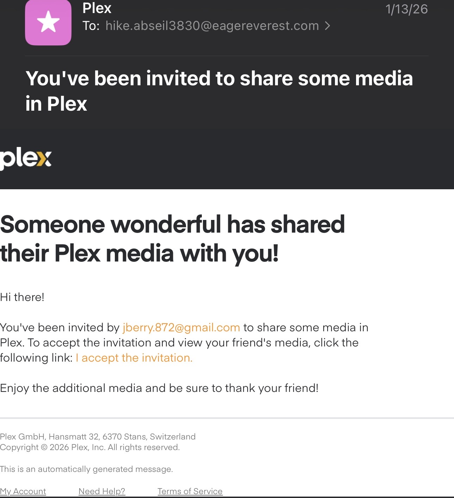
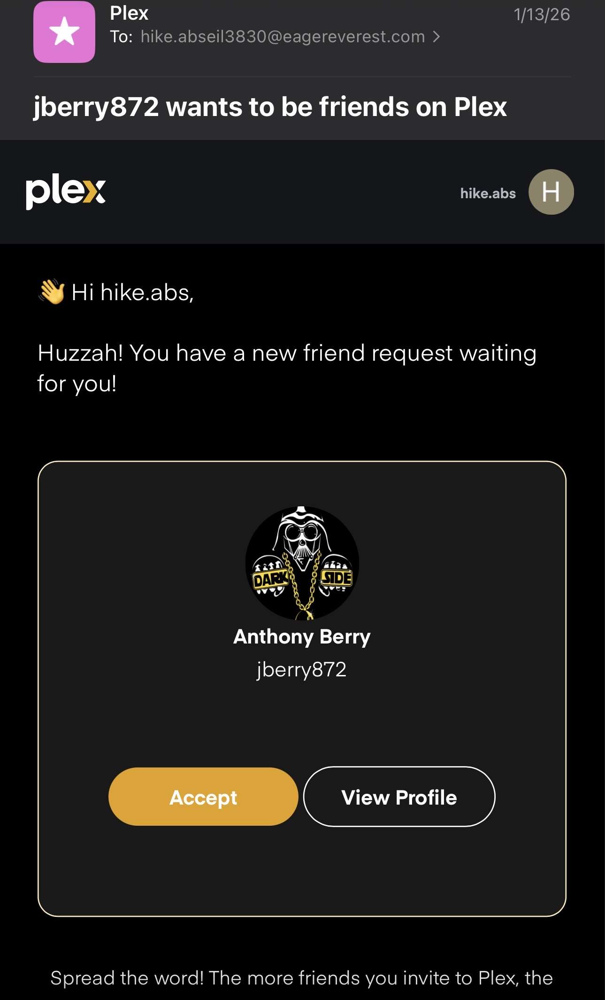

# Minerva-Plex
## How to watch Movies and TV from Plex/Jellyfin.  

> 1. Sign up for Plex [here:](https://www.plex.tv/sign-up/)  
> 2. Send Anthony your email used to sign up for Plex.
>  3. You will recieve **TWO** emails that need to be accepted
>> 
>> 
> 4. After accepting the server and friend invties, get signed into Plex wherever you want to watch.
>> Check out [Plex's documentation](https://support.plex.tv/articles/203395277-connect-app-to-your-plex-account/#toc-1) on connecting your apps to Plex for the first time.

## How can I check when my requested media downloaded and is ready to watch?  
Check the minerva-notifcations channel on the Vaderz Crib Discord.  
Join [here:](https://discord.gg/ZKRr9Xw8)  

Without blank lines, this might not look right.
> This is a blockquote
Don't do this!

1. First item
2. Second item
3. Third item
4. Fourth item